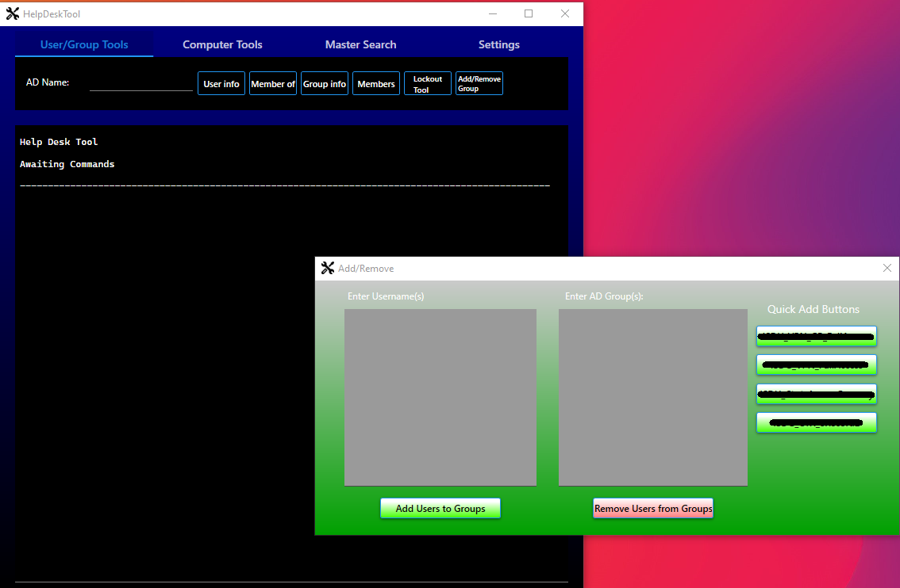

# Help Desk Tool
A C#/.NET desktop application created to ease the learning curve required to understand and effectively work on the help desk.
The tool accomplishes this by reducing complicated processes to single button actions.

This application uses custom-built tooling found in: 
* Active Directory Administrative Center
* DUO
* Employee Search
* A Learning Management Platform
* Microsoft Proprietary software
* Azure

Initial Creation: 9/25/2023

